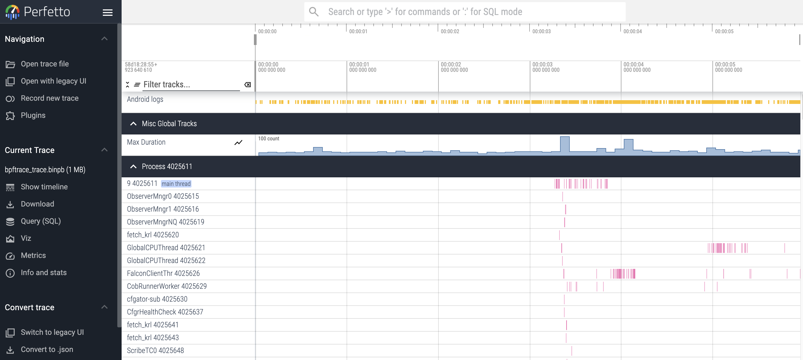

# btetto

A tool that produces [Perfetto](https://perfetto.dev/) protobuf from formatted [bpftrace](https://github.com/bpftrace/bpftrace) output.

[Rust Crate available here](https://crates.io/crates/btetto)

<center><a href="images/btetto_track_event.png"></a></center>

# Usage
```
$ sudo bpftrace my_script.bt -f json | btetto
Attached probes: 4
^C
Writing 149 events to trace file: bpftrace_trace.binpb
```

You can also pass a bpftrace output file to btetto e.g.
```
btetto my_bpftrace_output
```

btetto.py produces a **bpftrace_trace.binpb** protobuf file, which can then be loaded into the [Perfetto UI](https://ui.perfetto.dev/).

# bpftrace Output Format
The print output from bpftrace should be tuples (in JSON format e.g. `-f json`) where the first item in the tuple is the event type and the rest of the items are key/value tuples.

[**Examples**](./example_scripts/)

## Event Types
- `track_event`
- `call_stack`
- `stdout`

## Track Events (Spans)

**Required Fields**:
- `name` (string)
- `ts` (timestamp)
- `type` (string - see below)

**Optional Fields**:
- `pid` (number)
- `thread_name` (string)
- `tid` (number)
- `track` (string or number)
- `track_parent` (string or number)
- `unit` (string - see below)
- `flow_id` (string or number)
- `log` (tuple - see below)

**Track Event Types**
- `BEGIN`
- `END`
- `INSTANT`
- `COUNTER`

If the field is not listed above it will get logged as an annotation on the event like "bananas" and "greeting" below. pid, tid, and thread_name also get logged as annotations by default.

```
print(("track_event",
    ("name", "page_fault_user"),
    ("type", "BEGIN"),
    ("ts", $start),
    ("pid", pid),
    ("tid", tid),
    ("thread_name", comm),
    ("bananas", 10),
    ("greeting", "hello"),
    ("log", ("WARN", "this is my log message"))
));

print(("track_event",
    ("name", "page_fault_user"),
    ("type", "END"),
    ("ts", nsecs),
    ("pid", pid),
    ("tid", tid),
    ("thread_name", comm)
));
```

### track and track_parent

These are used to name the "tracks" where these events exist. At the moment they can be nested one level, where you would provide both a `track` and a `track_parent` tuple (both strings).

If `track` is not provided, you must then provide `pid`, `tid`, and `thread_name` tuples and then these track events will go into global pid/tid "tracks".

### unit
These are for `COUNTER` type track events and can be:
- `unspecified`
- `count` (default if no "unit" is provided)
- `size_bytes`
- `time_ns`

Example:
```
print(("track_event",
    ("name", "Max Duration"),
    ("type", "COUNTER"),
    ("ts", nsecs),
    ("track", "Max Duration"),
    ("unit", "count"),
    ("counter_value", @mx)
));
```

### log

The `log` tuple is a little different in that the value is another tuple where the first field is the log level and the second field is the log message e.g. `("log", ("FATAL", "This is an error message"))`. These show up as "Android Logs" in Perfetto.

**Valid Log Levels**
- `UNSPECIFIED`
- `UNUSED`
- `VERBOSE`
- `DEBUG`
- `INFO`
- `WARN`
- `ERROR`
- `FATAL`

## Call Stack Sample
These are for logging call stacks (kernel, user, or both) at specific points in time. They do not have durations.

**Required Fields**:
- `pid` (number)
- `tid` (number)
- `ts` (timestamp)
- `kstack` and/or `ustack` (array of strings)

**Optional Fields**:
- `thread_name` (string)

```
print(("call_stack",
    ("ts", nsecs),
    ("pid", pid),
    ("tid", tid),
    ("thread_name", comm),
    ("kstack", kstack),
    ("ustack", ustack)
));
```

## stdout

This just prints the value to the command line e.g.
```
BEGIN {
    print(("stdout", "Tracks the duration of page faults"));
}
```